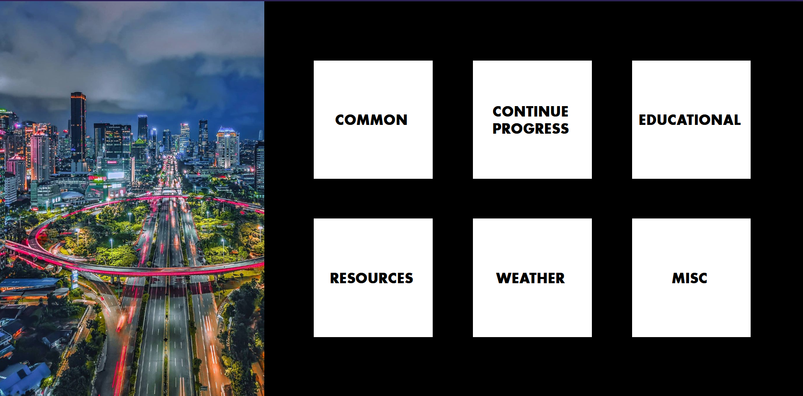

# multiblock-startpage
A clean startpage, with categories being separated in blocks. 
## mastartpage.html
Each block/square is within the "grid-container" DIV. 
The span of "grid-square" contains the block category name.
<H4> is used for dividing links into sub-categories.
Subreddits to retrieve images from are in the "subs" array.
Support for more blocks than 6 is something I would like to add in the future.
  
# Preview

